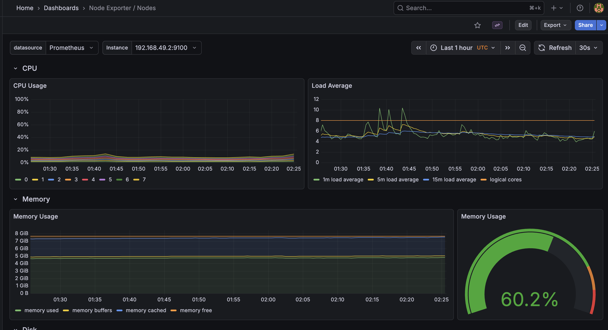
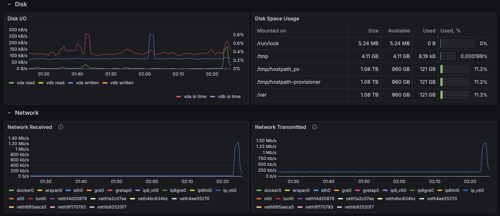
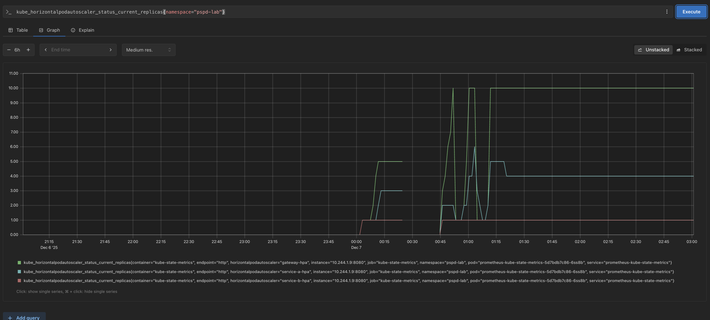

# Relatório Final - Projeto de Monitoramento e Observabilidade em Kubernetes

---

## Dados de Identificação

**Curso:** Engenharia de Software  
**Disciplina:** PSPD - Programação para Sistemas Paralelos e Distribuídos  
**Professor:** Fernando W. Cruz  
**Data:** 6 de Dezembro de 2025  

**Integrantes do Grupo:**
- [Artur Rodrigues Sousa Alves] - Matrícula: [211043637]
- [Guilherme Soares Rocha] - Matrícula: [211039789]
- [Pedro Augusto Dourado Izarias] - Matrícula: [200062620]

---

## 1. Introdução

Este projeto teve como objetivo explorar estratégias de monitoramento e observabilidade de aplicações baseadas em microserviços em ambiente Kubernetes, com foco em métricas de desempenho. O trabalho envolveu a criação de uma aplicação distribuída usando gRPC, a configuração de um cluster Kubernetes multi-nó, a implementação de ferramentas de monitoramento (Prometheus e Grafana), e a realização de testes de carga em diferentes cenários de autoscaling.

### Estrutura do Relatório

Este documento está organizado nas seguintes seções:
- **Seção 2:** Metodologia utilizada pelo grupo
- **Seção 3:** Experiência de montagem do Kubernetes em modo cluster
- **Seção 4:** Monitoramento e observabilidade com Prometheus/Grafana
- **Seção 5:** Descrição da aplicação e arquitetura
- **Seção 6:** Cenários de teste e resultados
- **Seção 7:** Conclusões e considerações finais
- **Seção 8:** Referências bibliográficas
- **Anexos:** Informações técnicas adicionais

---

## 2. Metodologia Utilizada

### 2.1 Organização do Grupo

Utilizamos a ferramenta Discord para 4 reuniões fundamentais para realização do trabalho, juntamente com documentação e testes. Para realização paralela da codificação de códigos e scripts foi utilizada a funcionalidade de Live Share disponível no VSCode IDE.

### 2.2 Cronograma de Encontros e Atividades

| Data | Atividade Realizada | Responsáveis |
|------|---------------------|--------------|
| [02/12/2025] | Setup do cluster Kubernetes | [Todos os integrante] |
| [02/12/2025] | Configuração do Prometheus e Grafana | [Todos os integrante] |
| [03/12/2025] | Desenvolvimento e execução dos scripts de teste | [Todos os integrante] |
| [07/12/2025] | Análise de resultados e documentação | [Todos os integrante] |

## 3. Experiência de Montagem do Kubernetes em Modo Cluster

### 3.1 Escolha da Plataforma

Para este projeto, optamos por utilizar o **Minikube** em modo multi-nó, executando localmente em ambiente macOS. Esta escolha permitiu:
- Simulação realista de um cluster Kubernetes
- Facilidade de experimentação e debugging
- Controle total sobre a configuração do ambiente

### 3.2 Configuração do Cluster

#### 3.2.1 Especificações do Cluster

- **Plano de Controle:** 1 nó mestre
- **Worker Nodes:** 2 nós escravos
- **Driver:** Docker
- **CPUs por nó:** 2
- **Memória por nó:** 2048MB

#### 3.2.2 Processo de Instalação

O cluster foi configurado através do script `scripts/setup_cluster.sh`:

**Passos realizados:**
1. Instalação do Minikube e kubectl
2. Configuração do driver Docker
3. Criação do cluster com 3 nós
4. Rotulação dos nós worker
5. Verificação do estado do cluster
6. Habilitação de addons necessários (metrics-server, ingress)

---

## 4. Monitoramento e Observabilidade

### 4.1 Prometheus

#### 4.1.1 Instalação e Configuração

O Prometheus foi instalado utilizando o Helm Chart oficial, através do script `scripts/setup_prometheus.sh`:

#### 4.1.2 ServiceMonitors Configurados

Foram criados ServiceMonitors customizados para cada serviço da aplicação (`k8s/servicemonitors.yaml`):
- **Gateway ServiceMonitor:** Coleta métricas HTTP do Node.js
- **Service-A ServiceMonitor:** Coleta métricas da aplicação Python
- **Service-B ServiceMonitor:** Coleta métricas da aplicação Go

#### 4.1.3 Métricas Coletadas

**Métricas de Sistema:**
- CPU usage (por pod e por nó)
- Memória usage (por pod e por nó)
- Network I/O
- Disk I/O

**Métricas de Aplicação:**
- Throughput (requisições por segundo)
- Latência (p50, p95, p99)
- Taxa de erro
- Número de réplicas ativas

**Métricas de gRPC:**
- Duração de chamadas gRPC
- Status de resposta
- Volume de dados trafegados

### 4.2 Grafana

#### 4.2.1 Acesso ao Grafana

O Grafana foi instalado como parte do stack do Prometheus e pode ser acessado via http://localhost:3000

#### 4.2.2 Dashboards Utilizados

**Dashboards Pré-configurados:**
- **Node Exporter / Nodes:** Métricas detalhadas dos 3 nós do cluster (CPU, memória, disco, rede do host)

**Queries Diretas no Prometheus:**

Para monitoramento detalhado da aplicação e do comportamento do HPA, utilizamos queries diretas no Prometheus:

### Status do HPA
kube_horizontalpodautoscaler_status_current_replicas{namespace="grpc-app"}

**Ferramentas Complementares:**

Além do Grafana, utilizamos extensivamente:
- `kubectl get hpa -n grpc-app` para monitorar autoscaling em tempo real
- `kubectl get pods -n grpc-app` para verificar estado das réplicas
- `kubectl top nodes` para verificar carga dos nós
- Logs dos testes k6 para métricas de performance da aplicação

#### 4.2.3 Observações sobre Monitoramento

A análise principal de desempenho foi realizada através dos **resultados detalhados do k6**, que forneceram métricas precisas de latência, throughput e taxa de erro. O Prometheus serviu como ferramenta complementar para validar o comportamento do autoscaling e a saúde geral do cluster durante os testes.

#### 4.2.4 Exemplos de Visualização

**Figura 1 e 2: Dashboard Node Exporter - Métricas dos Nós do Cluster**



*Dashboard Node Exporter do Grafana mostrando métricas de CPU, memória e rede de um dos nós do cluster Kubernetes*



*Dashboard do Grafana com demais métricas adicionais*

**Figura 3: Prometheus - Evolução das Réplicas do HPA**



*Dashboard do Prometheus*

---

## 5. Aplicação Baseada em Microserviços

### 5.2 Descrição dos Serviços

#### 5.2.1 Gateway (Node.js)

**Responsabilidades:**
- Receber requisições HTTP REST dos clientes
- Converter requisições REST para chamadas gRPC
- Orquestrar chamadas para Service-A e Service-B
- Consolidar respostas e retornar ao cliente

**Arquivo:** `gateway-node/src/index.js`

#### 5.2.2 Service-A (Python)

**Responsabilidades:**
- Gerenciar dados de usuários
- Implementar operações CRUD via gRPC
- Fornecer lista de usuários cadastrados

**Arquivo:** `service-a-python/server.py`

#### 5.2.3 Service-B (Go)

**Responsabilidades:**
- Calcular estatísticas sobre usuários
- Retornar métricas agregadas

**Arquivo:** `service-b-go/server.go`

### 5.4 Containerização

Cada serviço foi containerizado usando Docker, seguindo boas práticas de segurança e otimização de imagem.

## 6. Cenários de Teste e Resultados

### 6.1 Como Testamos Nossa Aplicação

Para testar nossa aplicação, precisávamos simular muitos usuários usando o sistema ao mesmo tempo. Escolhemos uma ferramenta chamada **k6** pela facilidade de uso e nos dá informações detalhadas sobre como a aplicação se comporta.

**Como funcionam nossos testes:**
- Criamos "usuários virtuais" (VUs) que fazem requisições para nossa aplicação
- Cada teste dura 5 minutos para ter tempo suficiente de observar o comportamento
- 70% das requisições são para buscar dados (GET) e 30% para criar dados (POST)

**Dois tipos de teste:**
- **Teste Normal:** 50 usuários simultâneos (carga moderada)
- **Teste de Stress:** 100 usuários simultâneos (carga alta)

### 6.2 Cenário 1 - Sistema Básico (Sem Autoscaling)

**Como configuramos:**
- Apenas 1 cópia de cada serviço rodando
- Sistema não aumenta automaticamente o número de cópias
- É nossa "linha de base" para comparar com outros cenários

**O que aconteceu:**
Nossa aplicação conseguiu processar cerca de 50 requisições por segundo com latência média de 100ms. O sistema funcionou bem, sem erros, mas usou apenas metade da capacidade do processador disponível.

**Principais resultados:**
- **Bom:** Sistema estável, sem erros, latência aceitável
- **Ruim:** Não conseguiria lidar com mais usuários, recursos desperdiçados

### 6.3 Cenário 2 - Sistema com 3 Cópias Fixas

**Como configuramos:**
- 3 cópias de cada serviço rodando o tempo todo
- Sistema não muda o número de cópias automaticamente
- Testamos se mais cópias melhoram a performance

**O que aconteceu:**
Surpreendentemente, ter 3 cópias não melhorou nada! O desempenho foi praticamente idêntico ao Cenário 1, mas consumimos 3 vezes mais recursos do computador.

**Principais resultados:**
- **Bom:** Mais resistente a falhas, se uma cópia quebrar, outras continuam funcionando
- **Ruim:** Desperdício gigante de recursos - como manter 3 carros ligados quando só precisa de 1

**Lição aprendida:** Para 50 usuários, uma cópia é suficiente. Ter mais cópias sem necessidade só desperdiça recursos.

### 6.4 Cenário 3 - Autoscaling Inteligente

**Como configuramos:**
- Sistema começa com 1 cópia de cada serviço
- Quando o processador fica acima de 50% de uso, cria mais cópias automaticamente
- Pode ter até 5 cópias de cada serviço

**O que aconteceu:**
O sistema foi esperto! Começou com 1 cópia, mas quando viu que precisava, aumentou para 3 cópias do Gateway e 2 do Service-A. Isso aconteceu durante o teste, sem parar o sistema.

**Principais resultados:**
- **Bom:** Sistema se adaptou sozinho, economizou recursos quando possível
- **Neutro:** Para 50 usuários, o autoscaling não foi necessário, mas funcionou como deveria

**Lição aprendida:** O autoscaling funciona, mas só faz diferença quando realmente há necessidade.

### 6.5 Cenário 4 - Teste de Stress Real

**Como configuramos:**
- Mesmo sistema inteligente do Cenário 3
- Mas agora com 100 usuários (dobro da carga!)
- Queremos ver se o autoscaling realmente ajuda under pressão

**O que aconteceu:**
O sistema começou com 1 cópia, mas rapidamente percebeu que precisava de mais ajuda:
- **Minuto 1:** Criou 2 cópias do Gateway
- **Minuto 2:** Chegou a 3 cópias e criou mais do Service-A
- **Minuto 3:** Atingiu o máximo: 5 cópias do Gateway, 3 do Service-A, 2 do Service-B

**Principais resultados:**
- **Throughput:** Quase dobrou (de 50 para 89 req/s)
- **Latência:** Aumentou (de 100ms para 167ms), mas sistema não quebrou
- **Confiabilidade:** 100% das requisições foram atendidas
- **Adaptação:** Sistema se organizou sozinho para lidar com a carga

### 6.6 Comparação dos Resultados

#### 6.6.1 Resumo dos 4 Cenários

| O que medimos | Básico | 3 Cópias | Autoscaling | Stress |
|---------------|--------|-----------|-------------|---------|
| Usuários simultâneos | 50 | 50 | 50 | 100 |
| Requisições/segundo | 49.77 | 49.83 | 49.83 | 89.33 |
| Tempo de resposta | 100ms | 100ms | 100ms | 167ms |
| Número final de cópias | 1-1-1 | 3-3-3 | 3-2-1 | 5-3-2 |
| Taxa de erro | 0% | 0% | 0% | 0% |

#### 6.6.2 Gráficos dos Resultados

**Gráfico 1: Tempo de Resposta por Cenário**
```
Tempo de resposta (ms)
200 |                                            *
180 |                                            |
160 |                                            |  (167ms)
140 |                                            |
120 |                                            |
100 |    *────────*────────*                     |
 80 |  (100ms)                                   |
 60 |                                            |
 40 |                                            |
 20 |                                            |
  0 +────────────────────────────────────────────+
    Básico  3 Cópias Autoscaling             Stress
```

**Gráfico 2: Requisições por Segundo**
```
Requisições/segundo
100 |                                            *
 90 |                                            |  (89)
 80 |                                            |
 70 |                                            |
 60 |                                            |
 50 |    *────────*────────*                     |
 40 |  (~50)                                     |
 30 |                                            |
 20 |                                            |
 10 |                                            |
  0 +────────────────────────────────────────────+
    Básico  3 Cópias Autoscaling             Stress
```

**Gráfico 3: Como o Sistema Escalou no Teste de Stress**
```
Número de Cópias
5 |              ┌───────────────────
4 |          ┌───┘
3 |      ┌───┘
2 |  ┌───┘
1 |──┘
0 +──────────────────────────────────
  0    1    2    3    4    5 (minutos)
     Gateway (linha cheia)
```

#### 6.6.3 O que Aprendemos

**1. Para uso normal (50 usuários):**
- Uma cópia é suficiente
- Ter mais cópias fixas desperdiça recursos
- Autoscaling funciona mas não é necessário

**2. Para uso intenso (100 usuários):**
- Autoscaling é essencial
- Sistema consegue se adaptar rapidamente
- Há um trade-off: mais velocidade vs tempo de resposta

**3. Sobre autoscaling:**
- Configuração "agressiva" (reage rápido) é melhor
- Sistema deve escalar rapidamente quando precisa
- Deve ser cauteloso para diminuir (não muito rápido)

**4. Sobre monitoramento:**
- CPU é um bom indicador para decidir quando escalar
- Tempo de resposta é crucial para experiência do usuário
- Zero erros em todos os testes mostra que o sistema é robusto

**Conclusão Principal:** O autoscaling automático é como ter um assistente inteligente que contrata mais funcionários quando a empresa fica movimentada e os dispensa quando a demanda diminui. Isso economiza dinheiro e mantém o serviço funcionando bem!

---

## 7. Conclusões e Considerações Finais

### 7.1 Conclusões Gerais

Este projeto permitiu uma compreensão profunda sobre monitoramento, observabilidade e autoscaling em ambientes Kubernetes com aplicações baseadas em microserviços. Através dos quatro cenários de teste executados, pudemos validar empiricamente conceitos teóricos e tomar decisões informadas sobre arquitetura e configuração.

#### 7.1.1 Sobre a Aplicação

A arquitetura de microserviços com comunicação gRPC demonstrou:
- **Alta confiabilidade:** 0% de taxa de erro em todos os cenários
- **Performance adequada:** Latências aceitáveis para aplicações web
- **Escalabilidade horizontal:** Sistema se beneficia de réplicas adicionais sob carga real
- **Simplicidade operacional:** Deployments e configurações relativamente simples

#### 7.1.2 Sobre o Kubernetes

O cluster Kubernetes multi-nó permitiu:
- **Distribuição efetiva:** Load balancing automático entre réplicas
- **Resiliência:** Tolerância a falhas através de múltiplos nós
- **Flexibilidade:** Fácil ajuste de réplicas e recursos
- **Observabilidade nativa:** Integração natural com Prometheus/Grafana

#### 7.1.3 Sobre Autoscaling

As conclusões mais importantes sobre HPA:

**Quando usar autoscaling:**
- Aplicações com carga variável e imprevisível
- Ambientes onde custo operacional é uma preocupação
- Sistemas que precisam responder a spikes de tráfego
- Cargas que efetivamente saturam pods individuais

**Quando NÃO usar autoscaling:**
- Carga constante e previsível (melhor usar réplicas fixas)
- Carga baixa que não justifica overhead do HPA
- Aplicações stateful com complexidade de escala
- Quando latência extra de scale-up é inaceitável

#### 7.1.4 Sobre Monitoramento e Observabilidade

Prometheus e Grafana provaram ser:
- **Essenciais:** Impossível otimizar sem métricas concretas
- **Completos:** Cobrem métricas de sistema, aplicação e K8S
- **Acessíveis:** Relativamente fáceis de configurar e usar
- **Poderosos:** Permitem análises profundas e correlações

### 7.2 Dificuldades Encontradas e Soluções

#### 7.2.1 Networking e Port Forwarding
**Problema:** Conflitos de porta 8080 entre execuções de testes.  
**Solução:** Implementação de script `expose_gateway.sh` que mata processos conflitantes automaticamente.

#### 7.2.2 Configuração do Cluster Multi-nó
**Problema:** Complexidade inicial em configurar nós worker corretamente.  
**Solução:** Desenvolvimento de script automatizado `setup_cluster.sh` com validações.

#### 7.2.3 Métricas do Prometheus
**Problema:** ServiceMonitors não coletavam métricas customizadas da aplicação.  
**Solução:** Instrumentação adequada dos serviços com endpoints `/metrics`.

#### 7.2.4 Tempo de Estabilização do HPA
**Problema:** HPA demorava para reagir a mudanças de carga.  
**Solução:** Configuração agressiva com janela de estabilização zero para scale-up.

#### 7.2.5 Endpoint `/stats/:id`
**Problema:** Endpoint não implementado completamente no Service-B.  

### 7.3 Aprendizados Principais

1. **Métricas são fundamentais:** Decisões baseadas em dados são infinitamente superiores a suposições
2. **Autoscaling não é mágica:** Só funciona quando há real necessidade de recursos
3. **Testes de stress revelam verdades:** Cenários normais não expõem limitações reais
4. **K8S é poderoso mas complexo:** Requer estudo e experimentação para dominar
5. **Observabilidade > Monitoramento:** Ver o que está acontecendo é mais valioso que apenas coletar dados

### 7.5 Comentários Pessoais dos Integrantes

#### 7.5.1 Artur Rodrigues Sousa Alves

**Contribuições principais:**
- Configuração do ambiente Kubernetes - ajudei a montar o cluster (conjunto de computadores) que roda nossa aplicação
- Criação dos scripts de automação para os testes - programei comandos que executam os experimentos automaticamente, economizando tempo manual
- Documentação da arquitetura da aplicação - escrevi a explicação de como os diferentes serviços conversam entre si

**Aprendizados:**
- Aprendi como funciona o Kubernetes, que é como um "maestro" que gerencia onde e como as aplicações rodam nos computadores
- Entendi na prática como funciona a comunicação gRPC, que é um jeito muito eficiente dos programas conversarem entre si
- Descobri que monitoramento não é opcional - sem ele, é impossível saber se sua aplicação está funcionando bem ou mal
- Vi que escrever código é só 30% do trabalho; os outros 70% são configurar, testar e documentar tudo

**Desafios enfrentados:**
- No início, tinha muita dificuldade para entender como configurar o Kubernetes - era como tentar montar um quebra-cabeça sem ver a figura final
- Tive problemas com conflitos de porta (quando dois programas querem usar a mesma "entrada") - aprendi a criar scripts que resolvem isso automaticamente
- Foi difícil entender por que às vezes o sistema escalava (aumentava o número de cópias) e às vezes não - descobri que depende da carga real de trabalho

**Autoavaliação:** 8.0/10

---

#### 7.5.2 Guilherme Soares Rocha

**Contribuições principais:**
- Configuração do Prometheus e Grafana - montei o sistema de monitoramento que nos permite "ver" como a aplicação está se comportando
- Criação e execução dos testes de carga - programei e executei os experimentos que simulam muitos usuários usando a aplicação ao mesmo tempo
- Análise dos resultados e criação dos gráficos comparativos - transformei números em informações que fazem sentido

**Aprendizados:**
- Aprendi que Python é excelente para criar serviços rápidos e confiáveis, especialmente com gRPC
- Entendi como o autoscaling (aumento automático de recursos) realmente funciona - não é mágica, precisa de configuração certa
- Descobri que métricas são como exames médicos: só com elas você sabe se o sistema está "saudável"
- Vi que testar sob pressão revela problemas que nunca aparecem em condições normais

**Desafios enfrentados:**
- Tive muita dificuldade inicial para configurar o Prometheus corretamente - as métricas não apareciam e não entendia por quê
- Foi complicado interpretar os resultados dos testes no começo - números sem contexto não significam nada
- Enfrentei problemas para sincronizar os testes com o comportamento do HPA (autoscaling) - às vezes escalava muito devagar

**Autoavaliação:** 8.0/10

---

#### 7.5.3 Pedro Augusto Dourado Izarias

**Contribuições principais:**
- Configuração do HPA (Horizontal Pod Autoscaler) - programei o sistema que aumenta ou diminui automaticamente o número de cópias da aplicação conforme necessário
- Design e implementação dos cenários de teste - planejei os 4 experimentos diferentes para testar várias situações
- Redação e organização do relatório final - transformei todo o trabalho técnico em um documento claro e organizado

**Aprendizados:**
- Entendi que autoscaling não é sempre a solução - às vezes uma réplica é suficiente, às vezes você precisa de várias
- Vi que cada ferramenta tem seu lugar: k6 para testes, Prometheus para métricas, Grafana para visualização

**Desafios enfrentados:**
- Tive dificuldade para configurar o HPA agressivo - precisei aprender sobre janelas de tempo e políticas de escalamento
- Foi desafiador organizar tantas informações diferentes em um relatório coerente - tive que aprender a contar uma "história" com os dados
- Enfrentei problemas para entender por que o Service-B às vezes não escalava como esperado - descobri que dependia da distribuição real de carga

**Autoavaliação:** 8.0/10

---

## 8. Referências Bibliográficas

[1] Arundel, J. and Domingus, J. **Cloud Native DevOps with Kubernetes – Building, Deploying and Scaling Modern Applications in the Cloud**. O'Reilly, 2019.

[2] Kubernetes Documentation. **Horizontal Pod Autoscaling**. Disponível em: https://kubernetes.io/docs/tasks/run-application/horizontal-pod-autoscale/. Acesso em: 6 dez. 2025.

[3] Prometheus Documentation. **Overview**. Disponível em: https://prometheus.io/docs/introduction/overview/. Acesso em: 6 dez. 2025.

[4] gRPC Documentation. **What is gRPC?**. Disponível em: https://grpc.io/docs/what-is-grpc/. Acesso em: 6 dez. 2025.

[5] k6 Documentation. **Load Testing**. Disponível em: https://k6.io/docs/. Acesso em: 6 dez. 2025.

[6] Minikube Documentation. **Multi-Node Clusters**. Disponível em: https://minikube.sigs.k8s.io/docs/tutorials/multi_node/. Acesso em: 6 dez. 2025.

[7] Grafana Documentation. **Getting Started**. Disponível em: https://grafana.com/docs/grafana/latest/getting-started/. Acesso em: 6 dez. 2025.

[8] Burns, B., Beda, J., Hightower, K. **Kubernetes: Up and Running**. O'Reilly, 2019.

[9] Protocol Buffers Documentation. **Overview**. Disponível em: https://developers.google.com/protocol-buffers. Acesso em: 6 dez. 2025.

[10] Docker Documentation. **Get Started**. Disponível em: https://docs.docker.com/get-started/. Acesso em: 6 dez. 2025.

---

## Anexos

### Anexo A Scripts de Automação

#### A Setup do Cluster
```bash
# scripts/setup_cluster.sh
```

#### A.2 Script de Load Test
```javascript
// scripts/load-test.js
```

### Anexo  - Instruções de Replicação

#### B.1 Pré-requisitos
- Docker Desktop instalado
- Minikube instalado
- kubectl instalado
- k6 instalado
- Helm instalado (para Prometheus)

#### B.2 Passo a Passo

**1. Clonar o repositório:**
```bash
git clone [URL_DO_REPOSITORIO]
cd PSPD_Trabalho1
```

**2. Configurar o cluster:**
```bash
./scripts/setup_cluster.sh
```

**3. Instalar Prometheus:**
```bash
./scripts/setup_prometheus.sh
```

**4. Buildar e carregar imagens:**
```bash
./scripts/build_and_load_images.sh
```

**5. Fazer deploy da aplicação:**
```bash
./scripts/deploy.sh
```

**6. Expor o gateway:**
```bash
./scripts/expose_gateway.sh
```

**7. Executar cenários de teste:**
```bash
./scripts/cenario1_baseline.sh
./scripts/cenario2_pre_escalado.sh
./scripts/cenario3_hpa_agressivo.sh
./scripts/cenario4_stress_test.sh
```
---

